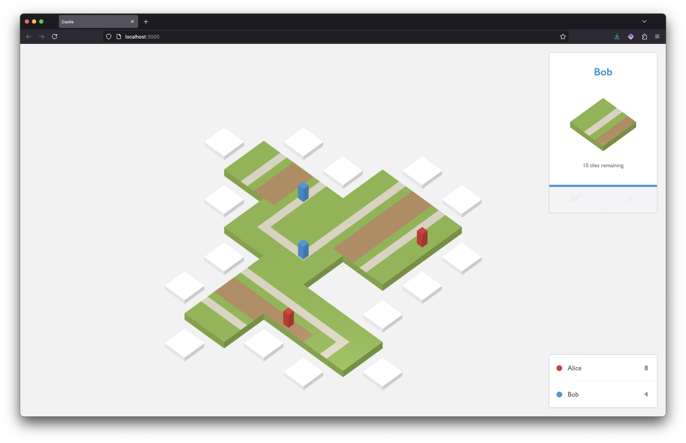

= Castle Web

image:https://cloud.drone.io/api/badges/castle-game/castle-web/status.svg[Build status, link=https://cloud.drone.io/castle-game/castle-web]
image:https://snyk.io/test/github/castle-game/castle-web/badge.svg[Vulnerabilities, link=https://snyk.io/test/github/castle-game/castle-web]
image:https://img.shields.io/badge/code_style-standard-brightgreen.svg[JavaScript Style Guide, link=https://standardjs.com]

Web client for Castle, using React and BabylonJS.

This project was bootstrapped with https://github.com/facebook/create-react-app[Create React App].

== Development

`npm start`::
Runs the app in development mode.
Open http://localhost:3000 to view it in the browser.

`npm test`::
Launches the test runner in the interactive watch mode.
See the section about https://facebook.github.io/create-react-app/docs/running-tests[running tests] for more information.

`npm run build`::
Builds the app for production to the `build` folder.
It bundles React in production mode and optimizes the build for the best performance.
